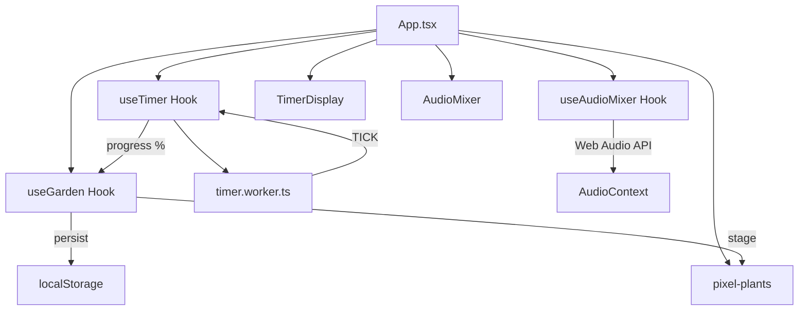

# Focus Valley — Product Requirements Document (PRD)

> **버전**: 2.0
> **작성일**: 2026-02-22
> **상태**: 현재 구현 동기화 완료

---

## 1. 제품 개요

**Focus Valley**는 포모도로 타이머, 픽셀 아트 가든, 앰비언트 사운드스케이프를 결합한 **브라우저 기반 집중력 향상 웹 애플리케이션**이다. 사용자가 집중 세션을 완료할 때마다 픽셀 식물이 자라나는 게이미피케이션 요소를 통해 지속적인 집중 동기를 부여하며, 배경 사운드 믹서로 몰입 환경을 조성한다.

### 핵심 가치 제안

| 항목 | 설명 |
|------|------|
| **타겟 사용자** | 집중력 향상이 필요한 학생, 직장인, 프리랜서 |
| **핵심 문제** | 장시간 집중 유지의 어려움, 외부 소음에 의한 산만함 |
| **솔루션** | 타이머 + 시각적 보상(식물 성장) + 청각적 환경(앰비언트 사운드) |
| **차별점** | 레트로 픽셀 아트 미학, 프리미엄 프리 + Pro 원타임 결제(₩19,900), Supabase 클라우드 동기화 |

---

## 2. 기술 스택

| 계층 | 기술 | 버전 |
|------|------|------|
| 런타임 | React + TypeScript | React 19, TS 5.9 |
| 빌드 | Vite | 7 |
| 스타일링 | Tailwind CSS + CSS 변수 | 4 |
| 상태 관리 | Zustand (persist 미들웨어) | 5 |
| 애니메이션 | Framer Motion | 12 |
| 아이콘 | Lucide React | 0.563 |
| 유틸리티 | clsx, tailwind-merge, class-variance-authority | — |
| 백엔드 | Supabase (Auth + Database) | — |
| 에러 모니터링 | Sentry | — |
| 분석 | Google Analytics 4 | — |
| 결제 | Lemon Squeezy (예정) | — |
| 배포 | 정적 사이트 + Supabase 클라우드 | — |

---

## 3. 핵심 기능 (구현 완료)

### 3.1 포모도로 타이머

- **모드**: FOCUS (25분), SHORT_BREAK (5분), LONG_BREAK (15분)
- **Web Worker 기반**: 백그라운드 탭에서도 정확한 1초 틱 보장 (`timer.worker.ts`)
- **제어**: 시작 / 일시정지 / 리셋
- **모드 전환**: `switchMode()` 함수로 모드 간 전환
- **UI**: CRT 글로우 이펙트가 적용된 대형 픽셀 폰트 디스플레이 (`Press Start 2P`)

### 3.2 픽셀 가든 (게이미피케이션)

- **성장 단계**: `SEED → SPROUT → BUD → TREE/FLOWER → (수확 가능)`
- **성장 로직**: FOCUS 모드 진행률에 연동
  - 0~10%: SEED
  - 10~40%: SPROUT
  - 40~80%: BUD
  - 100%: TREE
- **식물 사망**: 집중 세션 중 포기 시 `DEAD` 상태 전환 (확인 대화상자)
- **수확**: TREE/FLOWER 상태에서 클릭으로 수확 → 히스토리에 기록 → SEED로 리셋
- **영속 저장**: Zustand `persist` 미들웨어로 `localStorage` 저장 (`focus-valley-garden` 키)
- **비주얼**: SVG 기반 픽셀 아트 식물 5종 (Seed, Sprout, Bud, Tree, Dead)

### 3.3 앰비언트 사운드스케이프

- **Web Audio API 기반**: 순수 프로시저럴 사운드 생성 (외부 오디오 파일 불필요)
- **트랙 5종**:
  - 🌧️ Rain — 핑크 노이즈 + 로우패스 필터 (800Hz)
  - 🔥 Fire — 브라운 노이즈 + 로우패스 필터 (250Hz)
  - ☕ Cafe — 화이트 노이즈 (필터 없음, 현재 기본 구현)
  - 🌊 Stream — 화이트 노이즈 (필터 없음, 현재 기본 구현)
  - 📡 White — 순수 화이트 노이즈
- **개별 볼륨 제어**: 0~100% 슬라이더 (Lazy 트랙 로딩)
- **글로벌 음소거**: 전체 트랙 토글
- **부드러운 전환**: `setTargetAtTime`으로 볼륨 변화 스무딩 (0.1초)

### 3.4 UI / UX

- **레트로 픽셀 미학**: `Press Start 2P` 폰트, 픽셀 아트 식물
- **다크 모드 지원**: CSS 변수 기반 라이트/다크 테마, 토글 버튼 구현
- **반응형**: 모바일/데스크톱 대응 (`md:` 브레이크포인트)
- **앰비언트 배경**: Aurora blob, Fireflies, 그레인 오버레이, 도트 그리드
- **사운드스케이프 패널**: Framer Motion 애니메이션으로 표시/숨김
- **계절/날씨 테마**: `data-season`, `data-weather` 속성으로 동적 테마 전환

### 3.5 인증 & 클라우드 동기화

- **Supabase Auth**: 이메일/비밀번호, Google OAuth 로그인
- **클라우드 동기화**: 가든, 통계, 설정, 할 일 목록을 Supabase에 동기화 (`syncWithCloud`)
- **자동 동기화**: 로그인 시 자동 pull/merge, 세션 완료 후 자동 push

### 3.6 Pro 티어

- **수익화 모델**: 프리미엄 프리 + Pro 원타임 결제 (₩19,900, 평생 소유)
- **Pro 전용 기능**: 희귀 식물 8종+, 15+ 앰비언트 사운드, 무제한 카테고리, 고급 통계, 공유카드 커스텀 테마
- **업그레이드 모달**: `UpgradeModal` 컴포넌트, `ProGate` 래퍼로 기능 게이팅
- **구독 상태**: `useSubscription` Zustand 스토어

### 3.7 분석 & 에러 트래킹

- **GA4**: 세션 시작/완료/포기, 식물 수확/사망, 공유카드 생성 등 이벤트 트래킹
- **Sentry**: 에러 바운더리 (`ErrorBoundary`) 및 런타임 에러 캡처

### 3.8 온보딩 & 투어

- **온보딩**: 4단계 슬라이드 (환영 → 타이머=성장 → 중단=시들기 → 사운드&카테고리)
- **투어 가이드**: 7단계 인터랙티브 투어 (가든 → 타이머 → 모드 → 카테고리 → 사운드 → 빠른접근 → 단축키)
- **랜딩 페이지**: 첫 방문 사용자를 위한 인트로 + 3분 데모 모드

### 3.9 공유카드 & 마일스톤

- **공유카드**: Canvas API로 오늘의 집중 기록 이미지 생성 → Web Share API 또는 다운로드
- **세션 후 공유 프롬프트**: FOCUS 완료 1.5초 후 플로팅 "오늘의 기록 인증" 버튼 표시 (8초 후 자동 소멸)
- **마일스톤**: 수확/세션/스트릭 기반 7종 달성 배지 (토스트 알림)
- **주간 요약**: 매주 월요일 지난주 집중 통계 팝업

### 3.10 국제화 (i18n)

- **3개 언어**: 영어 (en), 한국어 (ko), 일본어 (ja)
- **자동 감지**: 브라우저 언어 기반 초기 로케일 설정
- **379+ 번역 키**: Zustand persist로 언어 설정 유지

---

## 4. 아키텍처

```
src/
├── App.tsx                         # 메인 오케스트레이션 (타이머/가든/믹서/공유)
├── main.tsx                        # React 엔트리포인트 + Sentry 초기화
├── index.css                       # CSS 변수 기반 테마 (라이트/다크/계절/날씨)
├── components/ (31 files)
│   ├── AppHeader.tsx               # 헤더 (다크모드, 설정, 정원, 통계, 인증)
│   ├── TimerDisplay.tsx            # 타이머 UI + 프로그레스 링
│   ├── AudioMixer.tsx              # 사운드 믹서 UI (Lazy)
│   ├── PlantGarden.tsx             # 픽셀 가든 + 파티클 + 호흡 애니메이션
│   ├── HistoryPanel.tsx            # 통계/히스토리 (히트맵, 주간, 카테고리, 공유카드)
│   ├── GardenCollection.tsx        # 수집한 식물 갤러리
│   ├── CategoryChips.tsx           # 카테고리 선택 칩
│   ├── AuthModal.tsx               # 로그인/회원가입 모달
│   ├── UpgradeModal.tsx            # Pro 업그레이드 모달 (₩19,900 원타임)
│   ├── ProGate.tsx                 # Pro 기능 게이팅 래퍼
│   ├── Onboarding.tsx              # 4단계 온보딩 슬라이드
│   ├── TourGuide.tsx               # 7단계 인터랙티브 투어
│   ├── LandingScreen.tsx           # 첫 방문 랜딩 + Pro 가치 피치
│   ├── SessionRecoveryDialog.tsx   # 세션 복구 다이얼로그
│   ├── WeeklySummaryPopup.tsx      # 주간 요약 팝업
│   └── ui/
│       ├── BottomSheet.tsx         # 공통 바텀시트 UI
│       └── pixel-plants.tsx        # SVG 픽셀 아트 식물 10종+
├── hooks/ (21 files)
│   ├── useTimer.ts                 # 타이머 (Web Worker + 세션 복구)
│   ├── useGarden.ts                # 가든 상태 (Zustand persist + 마일스톤)
│   ├── useAudioMixer.ts            # 사운드스케이프 (Web Audio API)
│   ├── useAuth.ts                  # Supabase 인증
│   ├── useSubscription.ts          # Pro 구독 상태
│   ├── useCategories.ts            # 카테고리 관리
│   ├── useTodos.ts                 # 할 일 목록
│   ├── useOnboarding.ts            # 온보딩 상태
│   ├── useTour.ts                  # 투어 가이드 상태
│   └── useLanding.ts               # 랜딩 페이지 상태
├── lib/ (11 files)
│   ├── analytics.ts                # GA4 이벤트 트래킹
│   ├── i18n.ts                     # 3개 언어 번역 (en/ko/ja)
│   ├── share-card.ts               # Canvas 기반 공유카드 생성
│   ├── sync.ts                     # Supabase 클라우드 동기화
│   ├── supabase.ts                 # Supabase 클라이언트
│   ├── stats.ts                    # 통계 계산 (주간, 히트맵, 카테고리)
│   ├── milestones.ts               # 마일스톤 정의
│   └── constants.ts                # 상수 + 카테고리 프리셋
└── workers/
    └── timer.worker.ts             # 타이머 Web Worker (1초 인터벌)
```

### 데이터 흐름



---

## 5. 미구현 / 개선 필요 사항

### 5.1 기능 갭

| # | 항목 | 현재 상태 | 비고 |
|---|------|-----------|------|
| ~~1~~ | ~~다크 모드 전환~~ | ✅ 구현 완료 | 토글 버튼 + `.dark` 클래스 |
| ~~2~~ | ~~히스토리 뷰~~ | ✅ 구현 완료 | 히트맵, 주간 요약, 카테고리별 분석, CSV 내보내기 |
| ~~3~~ | ~~타이머 완료 알림~~ | ✅ 구현 완료 | 커스텀 사운드 + 브라우저 Notification API |
| 4 | **Cafe/Stream 사운드** | 화이트 노이즈와 동일 | 고유 노이즈 프로파일 미구현 |
| ~~5~~ | ~~Framer Motion 활용~~ | ✅ 구현 완료 | 전체 UI 애니메이션 적용 |
| ~~6~~ | ~~식물 종류~~ | ✅ 구현 완료 | 10종+ (스트릭/딥포커스 잠금 해제) |
| 7 | **결제 연동** | 미구현 | Lemon Squeezy 연동 필요 (₩19,900 원타임) |
| 8 | **AI 집중 인사이트** | 미구현 | Pro 전용 기능으로 계획 |

### 5.2 기술 부채

| # | 항목 | 설명 |
|---|------|------|
| 1 | 테스트 부재 | 유닛/E2E 테스트 없음 |
| 2 | Sentry DSN 하드코딩 | `main.tsx`에 직접 작성 — env var로 이동 권장 |
| 3 | 접근성 (a11y) | 부분 구현 (ARIA 레이블 일부), 키보드 네비게이션 개선 필요 |

---

## 6. 향후 로드맵

### Phase 1 — 핵심 품질 개선
- [ ] 다크/라이트 모드 토글 구현
- [ ] 타이머 완료 시 사운드 + 브라우저 알림
- [ ] 히스토리 뷰 (수확 기록, 총 집중 시간 통계)
- [ ] `window.confirm/alert`를 커스텀 모달로 교체
- [ ] Cafe/Stream 고유 노이즈 프로파일

### Phase 2 — 경험 확장
- [ ] 다양한 식물 종류 (랜덤 부여 또는 선택)
- [ ] Framer Motion 애니메이션 (식물 성장, 페이지 전환)
- [ ] 커스텀 타이머 시간 설정
- [ ] 포모도로 세션 카운터 (4회 후 Long Break 자동 전환)
- [ ] 키보드 단축키 (Space: 시작/일시정지, R: 리셋)

### Phase 3 — 고도화
- [ ] PWA 지원 (오프라인, 홈 화면 설치)
- [ ] 더 풍부한 사운드스케이프 (실제 오디오 파일 or 고급 프로시저럴)
- [ ] 가든 그리드 (수확한 식물들이 모인 나의 정원)
- [ ] 일일/주간 집중 리포트
- [ ] 소셜 공유 (집중 기록 이미지 생성)

---

## 7. 성공 지표

| 지표 | 측정 방법 |
|------|-----------|
| 일일 집중 세션 완료율 | 시작 대비 완료 비율 |
| 식물 수확 수 | localStorage 히스토리 카운트 |
| 평균 세션 시간 | 타이머 사용 패턴 (로컬 분석) |
| 사운드스케이프 사용률 | 볼륨 > 0인 트랙 비율 |
| 재방문율 | PWA 설치 후 재방문 측정 (Phase 3) |

---

## 8. 제약 조건

- **프리미엄 프리 모델**: 핵심 기능 무료, Pro 원타임 결제(₩19,900)로 고급 기능 해제
- **데이터 저장**: 로컬 localStorage 기본 + Supabase 클라우드 동기화 (로그인 시)
- **프라이버시**: 분석 데이터(GA4) 비식별 수집, 민감 데이터는 Supabase Row Level Security 적용
- **브라우저 호환성**: Web Audio API, Web Worker 지원 브라우저 필수
- **오디오 정책**: 브라우저 자동재생 정책으로 인해 사용자 제스처 후 AudioContext 활성화
