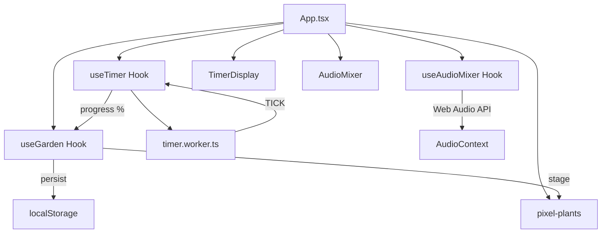

# Focus Valley — Product Requirements Document (PRD)

> **버전**: 1.0  
> **작성일**: 2026-02-13  
> **상태**: 현재 구현 분석 기반 초안

---

## 1. 제품 개요

**Focus Valley**는 포모도로 타이머, 픽셀 아트 가든, 앰비언트 사운드스케이프를 결합한 **브라우저 기반 집중력 향상 웹 애플리케이션**이다. 사용자가 집중 세션을 완료할 때마다 픽셀 식물이 자라나는 게이미피케이션 요소를 통해 지속적인 집중 동기를 부여하며, 배경 사운드 믹서로 몰입 환경을 조성한다.

### 핵심 가치 제안

| 항목 | 설명 |
|------|------|
| **타겟 사용자** | 집중력 향상이 필요한 학생, 직장인, 프리랜서 |
| **핵심 문제** | 장시간 집중 유지의 어려움, 외부 소음에 의한 산만함 |
| **솔루션** | 타이머 + 시각적 보상(식물 성장) + 청각적 환경(앰비언트 사운드) |
| **차별점** | 레트로 픽셀 아트 미학, 제로 코스트(완전 클라이언트 사이드), 서버 불필요 |

---

## 2. 기술 스택

| 계층 | 기술 | 버전 |
|------|------|------|
| 런타임 | React + TypeScript | React 19.2, TS 5.9 |
| 빌드 | Vite | 7.3 |
| 스타일링 | Tailwind CSS + CSS 변수 | 4.1 |
| 상태 관리 | Zustand (persist 미들웨어) | 5.0 |
| 애니메이션 | Framer Motion (설치됨, 미사용) | 12.34 |
| 아이콘 | Lucide React | 0.563 |
| 유틸리티 | clsx, tailwind-merge, class-variance-authority | — |
| 배포 | 정적 사이트 (서버리스) | — |

---

## 3. 핵심 기능 (구현 완료)

### 3.1 포모도로 타이머

- **모드**: FOCUS (25분), SHORT_BREAK (5분), LONG_BREAK (15분)
- **Web Worker 기반**: 백그라운드 탭에서도 정확한 1초 틱 보장 (`timer.worker.ts`)
- **제어**: 시작 / 일시정지 / 리셋
- **모드 전환**: `switchMode()` 함수로 모드 간 전환
- **UI**: CRT 글로우 이펙트가 적용된 대형 픽셀 폰트 디스플레이 (`Press Start 2P`)

### 3.2 픽셀 가든 (게이미피케이션)

- **성장 단계**: `SEED → SPROUT → BUD → TREE/FLOWER → (수확 가능)`
- **성장 로직**: FOCUS 모드 진행률에 연동
  - 0~10%: SEED
  - 10~40%: SPROUT
  - 40~80%: BUD
  - 100%: TREE
- **식물 사망**: 집중 세션 중 포기 시 `DEAD` 상태 전환 (확인 대화상자)
- **수확**: TREE/FLOWER 상태에서 클릭으로 수확 → 히스토리에 기록 → SEED로 리셋
- **영속 저장**: Zustand `persist` 미들웨어로 `localStorage` 저장 (`focus-valley-garden` 키)
- **비주얼**: SVG 기반 픽셀 아트 식물 5종 (Seed, Sprout, Bud, Tree, Dead)

### 3.3 앰비언트 사운드스케이프

- **Web Audio API 기반**: 순수 프로시저럴 사운드 생성 (외부 오디오 파일 불필요)
- **트랙 5종**:
  - 🌧️ Rain — 핑크 노이즈 + 로우패스 필터 (800Hz)
  - 🔥 Fire — 브라운 노이즈 + 로우패스 필터 (250Hz)
  - ☕ Cafe — 화이트 노이즈 (필터 없음, 현재 기본 구현)
  - 🌊 Stream — 화이트 노이즈 (필터 없음, 현재 기본 구현)
  - 📡 White — 순수 화이트 노이즈
- **개별 볼륨 제어**: 0~100% 슬라이더 (Lazy 트랙 로딩)
- **글로벌 음소거**: 전체 트랙 토글
- **부드러운 전환**: `setTargetAtTime`으로 볼륨 변화 스무딩 (0.1초)

### 3.4 UI / UX

- **레트로 픽셀 미학**: `Press Start 2P` 폰트, 픽셀 아트 식물
- **다크 모드 지원**: CSS 변수 기반 라이트/다크 테마 정의 (전환 UI 미구현)
- **반응형**: 모바일/데스크톱 대응 (`md:` 브레이크포인트)
- **앰비언트 배경**: 블러 처리된 그래디언트 원형 파티클 (CSS 기반)
- **사운드스케이프 패널**: 토글 슬라이드 애니메이션으로 표시/숨김

---

## 4. 아키텍처

```
src/
├── App.tsx                     # 메인 앱 — 타이머/가든/믹서 오케스트레이션
├── main.tsx                    # React 엔트리포인트
├── index.css                   # CSS 변수 기반 테마 (라이트/다크)
├── App.css                     # 추가 스타일
├── lib/
│   └── utils.ts                # cn() 유틸리티 (clsx + tailwind-merge)
├── hooks/
│   ├── useTimer.ts             # 포모도로 타이머 로직 (Web Worker 연동)
│   ├── useGarden.ts            # 가든 상태 관리 (Zustand persist)
│   └── useAudioMixer.ts        # 사운드스케이프 (Web Audio API)
├── components/
│   ├── TimerDisplay.tsx        # 타이머 UI 컴포넌트
│   ├── AudioMixer.tsx          # 사운드 믹서 UI 컴포넌트
│   └── ui/
│       └── pixel-plants.tsx    # 픽셀 아트 식물 SVG 컴포넌트 5종
└── workers/
    └── timer.worker.ts         # 타이머 Web Worker (1초 인터벌)
```

### 데이터 흐름



---

## 5. 미구현 / 개선 필요 사항

### 5.1 기능 갭 (우선순위 높음)

| # | 항목 | 현재 상태 | 개선 방향 |
|---|------|-----------|-----------|
| 1 | **다크 모드 전환** | CSS 변수 정의됨, 전환 UI 없음 | 토글 버튼 + `class`="dark" 전환 구현 |
| 2 | **히스토리 뷰** | 히스토리 버튼 존재, 동작 없음 | 수확한 식물 목록/통계 모달 |
| 3 | **타이머 완료 알림** | 타이머 종료 시 조용히 멈춤 | 사운드 알림 + 브라우저 알림 API |
| 4 | **Cafe/Stream 사운드** | 화이트 노이즈와 동일, 차별화 없음 | 고유 노이즈 프로파일 구현 |
| 5 | **Framer Motion 활용** | 의존성 설치됨, 코드에서 미사용 | 페이지 전환/식물 성장 애니메이션 적용 |
| 6 | **식물 종류** | `PlantType` 정의됨 (DEFAULT, CACTUS, SUNFLOWER, PINE), DEFAULT만 사용 | 랜덤/선택 가능한 다양한 식물 |

### 5.2 기술 부채

| # | 항목 | 설명 |
|---|------|------|
| 1 | `@ts-ignore` 사용 | `timer.worker.ts`에 3곳 — 적절한 타입 정의 필요 |
| 2 | `useEffect` 의존성 | `App.tsx`의 가든 동기화 이펙트에서 `garden` 객체 전체를 의존성으로 사용 — 무한 렌더링 위험 |
| 3 | `window.confirm` / `alert` | 네이티브 대화상자 대신 커스텀 모달로 교체 필요 |
| 4 | README | Vite 보일러플레이트 그대로 — 프로젝트 설명으로 교체 필요 |
| 5 | 테스트 부재 | 유닛/E2E 테스트 없음 |
| 6 | 접근성 (a11y) | ARIA 레이블, 키보드 네비게이션 미구현 |

---

## 6. 향후 로드맵

### Phase 1 — 핵심 품질 개선
- [ ] 다크/라이트 모드 토글 구현
- [ ] 타이머 완료 시 사운드 + 브라우저 알림
- [ ] 히스토리 뷰 (수확 기록, 총 집중 시간 통계)
- [ ] `window.confirm/alert`를 커스텀 모달로 교체
- [ ] Cafe/Stream 고유 노이즈 프로파일

### Phase 2 — 경험 확장
- [ ] 다양한 식물 종류 (랜덤 부여 또는 선택)
- [ ] Framer Motion 애니메이션 (식물 성장, 페이지 전환)
- [ ] 커스텀 타이머 시간 설정
- [ ] 포모도로 세션 카운터 (4회 후 Long Break 자동 전환)
- [ ] 키보드 단축키 (Space: 시작/일시정지, R: 리셋)

### Phase 3 — 고도화
- [ ] PWA 지원 (오프라인, 홈 화면 설치)
- [ ] 더 풍부한 사운드스케이프 (실제 오디오 파일 or 고급 프로시저럴)
- [ ] 가든 그리드 (수확한 식물들이 모인 나의 정원)
- [ ] 일일/주간 집중 리포트
- [ ] 소셜 공유 (집중 기록 이미지 생성)

---

## 7. 성공 지표

| 지표 | 측정 방법 |
|------|-----------|
| 일일 집중 세션 완료율 | 시작 대비 완료 비율 |
| 식물 수확 수 | localStorage 히스토리 카운트 |
| 평균 세션 시간 | 타이머 사용 패턴 (로컬 분석) |
| 사운드스케이프 사용률 | 볼륨 > 0인 트랙 비율 |
| 재방문율 | PWA 설치 후 재방문 측정 (Phase 3) |

---

## 8. 제약 조건

- **제로 코스트**: 서버 비용 없음, 완전 정적 사이트 배포
- **프라이버시**: 모든 데이터 로컬 저장 (서버 전송 없음)
- **브라우저 호환성**: Web Audio API, Web Worker 지원 브라우저 필수
- **오디오 정책**: 브라우저 자동재생 정책으로 인해 사용자 제스처 후 AudioContext 활성화
